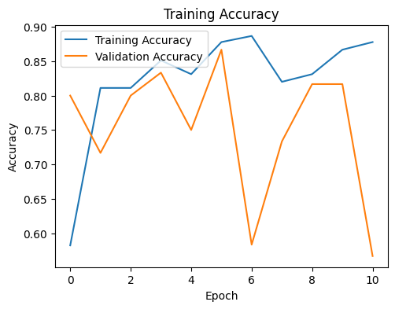
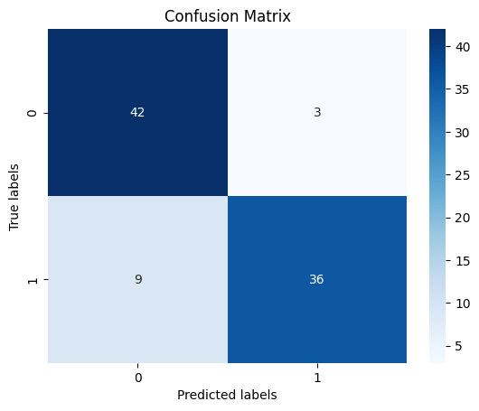
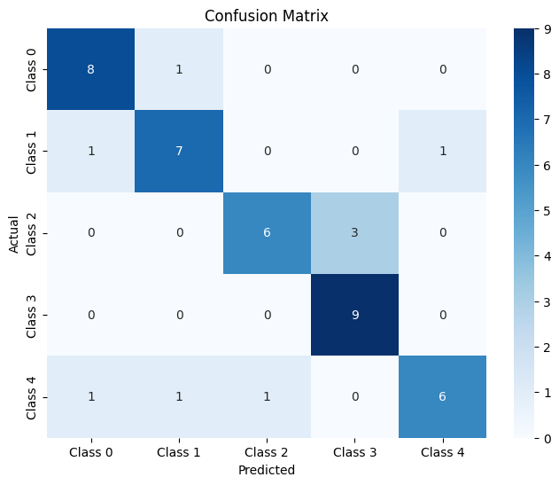

# Animal-Image-Classification-One-vs-Rest-Binary-and-5-Class-using-Custom-CNN
#### This repository contains resources and code for performing classification tasks as per the IITGN internship task
## Requirements
- Python 3.10
- TensorFlow
- Keras
- NumPy
- pandas
- scikit-learn
- Matplotlib
- seaborn

### Dataset Folders
The datasets and their corresponding splits for One-vs-Rest Classification are stores in  `dataset`  and  `split`  folders. 
The same for 5 class classification are stored in  `dataset2`  and  `split2` . 

### One-vs-Rest Classification
[ovr.ipynb](https://github.com/Lyra0710/Lyra0710-Animal-Image-Classification-One-vs-Rest-Binary-and-5-Class-using-Custom-CNN/blob/main/ovr.ipynb)
#### Data Preparation
For the purpose of this task, two classes were chosen: raccoons and non-raccoons. To perform for other categories against the remaining classes, a simple python script can be written for all possible combinations. 
The `animals` directory contains the original images, and the `dataset` directory contains the processed data.
The `split` directory contains the train, test and validation splits. 

#### Data Augmentation

Data augmentation techniques are applied to increase the diversity of the dataset. Augmentation includes random brightness adjustment, zooming, flipping, rotation, and shearing. This was performed on the train set for both classes for upto 225 images. The test and val have 45 images. 

#### Model Development

After trial and error, a custom CNN was developed this task. This model includes convolutional layers, max-pooling layers, and fully connected layers. The final layer uses softmax activation for multi-class classification.

#### Training and Evaluation

- Models are trained and evaluated using training, validation, and test datasets. 
- Training is performed over 100 epochs, and validation data are used to monitor model performance and prevent overfitting. Early stopping techniques are employed to stop training when validation loss starts increasing. 
- The final accuracy achieved on the test set was `85%`.

#### Results and Analysis

- The plot above shows the training and validation accuracy over epochs.

- The plot above shows the training and validation loss over epochs.

- The confusion matrix provides insights into the model's performance on each class, showing the actual vs. predicted labels.

### Five class Classification
[five_class.ipynb](https://github.com/Lyra0710/Lyra0710-Animal-Image-Classification-One-vs-Rest-Binary-and-5-Class-using-Custom-CNN/blob/main/five_class.ipynb)
#### Data Preparation

- The dataset is organized into five classes: antelope, badger, cat, dolphin, and elephant.

#### Augmentation

- Augmented images for all the class were generated using various transformations such as random brightness adjustment, zooming, flipping, rotation, and shearing.

#### Splitting

- The dataset was split into train, test, and validation sets for each class using a stratified split method.

#### Custom CNN Model

- The model consists of multiple convolutional layers followed by max-pooling layers.
- The last layer is a fully connected layer with softmax activation for multi-class classification.
- The model was compiled using the Adam optimizer and categorical cross-entropy loss function.

#### Training and Evaluation

- The model was trained for 50 epochs on the training set and evaluated on the test set.
- The training and validation accuracy and loss were monitored throughout the training process.
- The final accuracy achieved on the test set was `80%`.

#### Results

- The plot above shows the training and validation accuracy over epochs.

- The plot above shows the training and validation loss over epochs.

- The confusion matrix provides insights into the model's performance on each class, showing the actual vs. predicted labels.

### Convolutional Layer plots
Please see: [conv_vis.ipynb](https://github.com/Lyra0710/Lyra0710-Animal-Image-Classification-One-vs-Rest-Binary-and-5-Class-using-Custom-CNN/blob/main/conv_vis.ipynb). A sample image was used per model for the visualization. 

## Acknowledgements and References
- The data used in this project is sourced from [Kaggle](https://www.kaggle.com/datasets/iamsouravbanerjee/animal-image-dataset-90-different-animals?resource=download).
- Sources:
  - https://machinelearningmastery.com/one-vs-rest-and-one-vs-one-for-multi-class-classification/
  - https://medium.com/@agrawalsam1997/multiclass-classification-onevsrest-and-onevsone-classification-strategy-2c293a91571a
  - https://medium.com/geekculture/multiclass-image-classification-dcf9585f2ff9
  - https://www.analyticsvidhya.com/blog/2019/04/build-first-multi-label-image-classification-model-python/

### Additional comments and learnings:
- Accuracy can be better and worked upon with more time.
- Tested the 5 class classification model on state-of-the-art models like VGG 16 and Densenet to understand the baseline to build custom CNN models.
- Attempted to build a custom CNN for 5 class classification based on certains insights from these models. 
# Animal-Image-Classification-One-vs-Rest-Binary-and-5-Class-using-Custom-CNN

